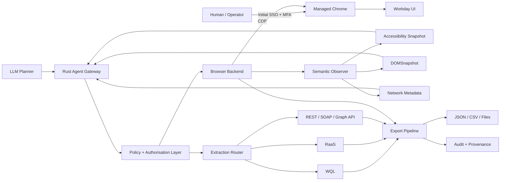
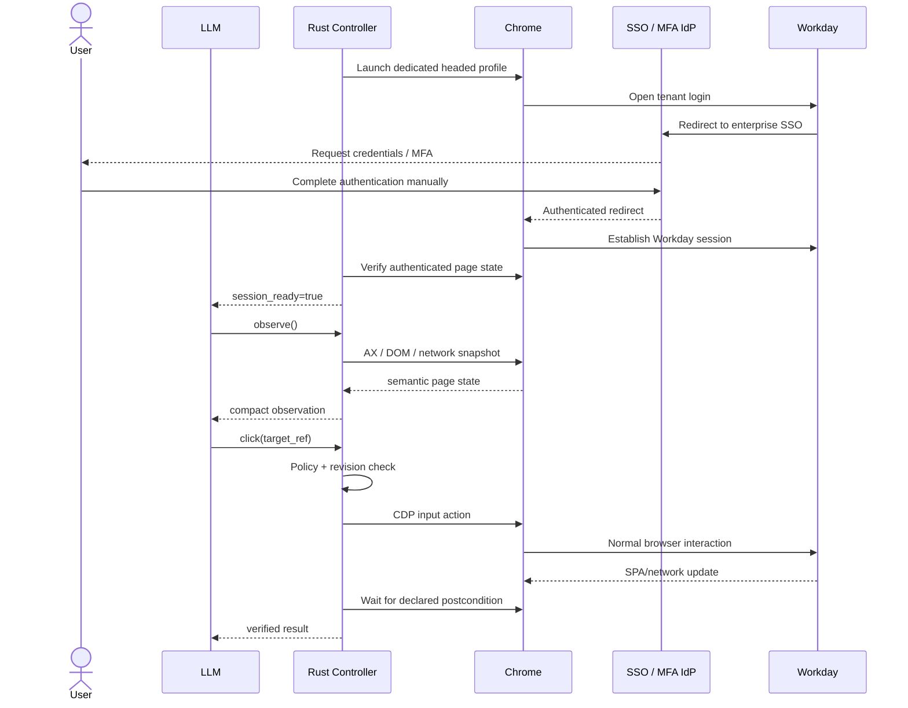
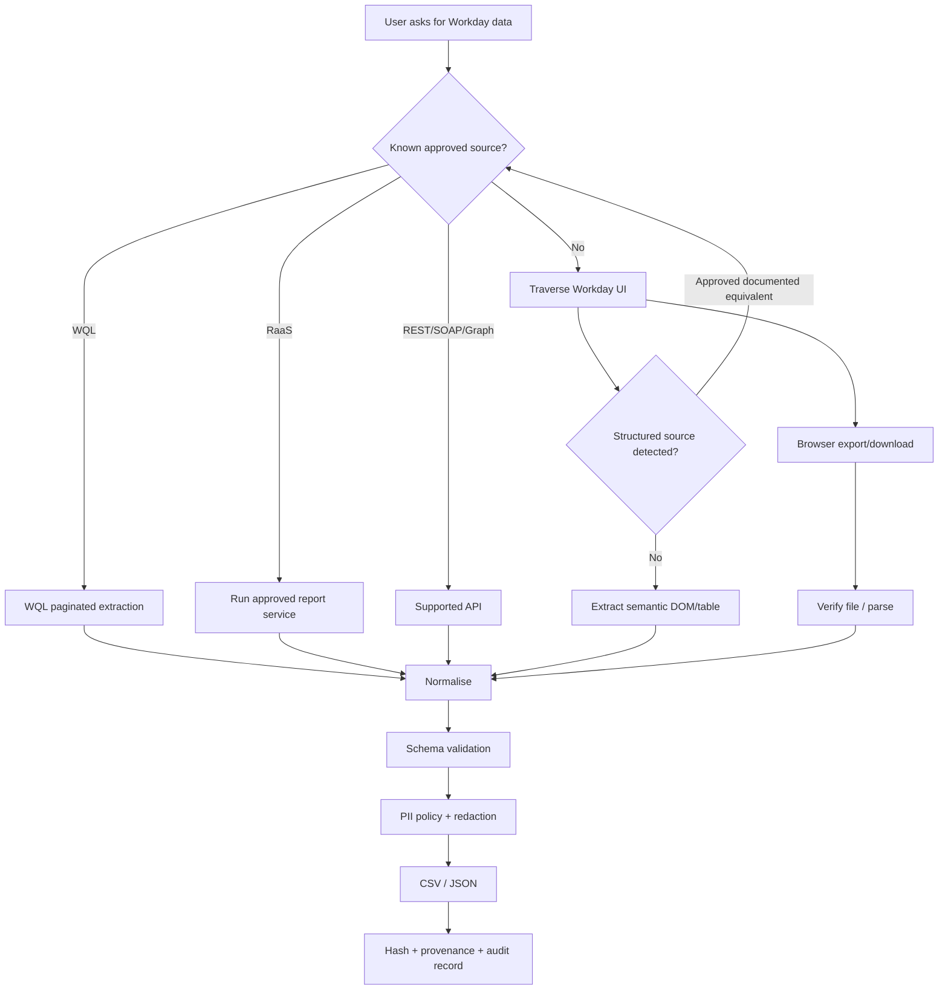

# Rust-Based LLM Automation for Efficient Workday Traversal in Chrome

## Executive summary

The central architectural conclusion is: **do not build a new browser engine for this problem**. Build a **Rust control and extraction layer around a real, managed Chrome/Chromium instance**, and give the LLM a deliberately small semantic automation API rather than raw browser access.

That conclusion is consistent with the earlier saved discussion: the important advantage comes from the **automation interface exposed to the LLM, not from Rust being the rendering engine**. The earlier discussion proposed proving the interaction model against an existing browser before building a custom Rust shell. fileciteturn0file0 The earlier feasibility matrix and accompanying report explored WebView, terminal and Servo-style approaches more broadly; for Workday specifically, those approaches should now be treated as preliminary exploration rather than the recommended implementation architecture. fileciteturn0file1 fileciteturn0file2

For Workday, I recommend a **two-plane design**:

1. **Browser control plane:** headed or headless Chrome controlled by Rust through Chrome DevTools Protocol (CDP), primarily for SSO/MFA hand-off, discovery, navigation, report selection, UI-only workflows and verification.
2. **Data extraction plane:** whenever Workday exposes the required information through an approved REST/SOAP API, Workday Query Language (WQL), Reports-as-a-Service (RaaS), or Graph API, use that channel instead of traversing thousands of rendered links or rows. Workday explicitly supports WQL pagination in blocks of up to 10,000 rows, while its Graph API is designed to consolidate data that otherwise requires multiple REST calls. citeturn13search3turn13search4

This changes the optimisation target. The fastest system is not one that clicks Workday pages 30% faster; it is one that **recognises when clicking is unnecessary**.



Chrome CDP natively exposes the mechanisms needed for this architecture: DOM inspection, accessibility trees, network request/response events and bodies, page lifecycle events, and controlled file-download events. citeturn17search5turn16search9turn16search15turn17search3turn17search2

For the Rust browser layer, my preferred evaluation order is:

| Priority | Technology | Recommended role |
|---|---|---|
| **Primary prototype** | `chromiumoxide` | Direct async Rust→CDP control; broad protocol escape hatch; suitable foundation for a custom LLM-facing service. citeturn19view5 |
| **Strong alternative / watch closely** | `cdp-rs` / `cdp-core` | Modern async CDP API with cross-frame/shadow-root querying, network interception, accessibility and smart waiting; attractive API but newer ecosystem. citeturn20view0 |
| **Agent-quality baseline** | `playwright-rust` or official Playwright MCP | Best reference for locator/auto-wait behaviour and semantic LLM interaction; Rust binding adds a Playwright driver process. citeturn19view3turn20view2 |
| **Compatibility fallback** | `fantoccini` | Mature asynchronous W3C WebDriver approach and cross-browser portability. citeturn19view2 |
| **Simple CDP spike** | `headless_chrome` | Easy direct Chromium control, but synchronous/thread-based and missing some browser capabilities important to complex enterprise SPAs. citeturn19view0 |
| **Do not use for this project** | Servo | Browser engine/embedding project, not a mature Chrome automation stack; still pre-1.0 as an embeddable library. citeturn20view1 |
| **Do not use for Workday production automation** | BrowserOxide/stealth-oriented “oxide” variants | From-scratch/anti-detection objectives are unnecessary and introduce compatibility and compliance risk for an authorised enterprise integration. citeturn12search3 |

The **production recommendation** is therefore:

> **Managed Chrome + dedicated browser profile + Rust/Tokio automation daemon + direct CDP + compact semantic observations + API-first Workday extraction + strict read-only policy + human SSO/MFA hand-off.**

The single biggest non-technical dependency is authorisation. Workday's current online terms prohibit data-mining/robot extraction and applications interacting with covered Workday sites without prior written consent. At the same time, Workday states that customer contractual obligations depend on the documents referenced by the customer's Order Form or UMSA. Therefore, internal tenant automation needs an explicit contract/security review rather than assuming that possession of a valid employee login makes bulk browser automation permissible. citeturn15view0turn14search3


## Problem decomposition, assumptions and target metrics

The problem becomes considerably easier when divided into **session acquisition, semantic observation, action execution, extraction, export and governance** instead of treating it as “make an LLM browse Workday”.

| Segment | Rust layer responsibility | LLM responsibility | Prefer not to give the LLM |
|---|---|---|---|
| Authentication | Launch/reconnect browser, detect authenticated state, pause for human MFA | Recognise that authentication is required | Passwords, MFA seeds, raw cookies |
| Discovery | Enumerate actionable controls and meaningful page state | Decide which semantic action advances the task | Entire raw DOM |
| Navigation | Execute click/type/select/scroll/wait safely | Select target/action | Arbitrary JavaScript execution |
| Dynamic-page handling | Detect route changes, DOM/AX changes, network settle and pagination progress | Interpret changed state | Low-level CDP details |
| Extraction | Choose approved API/RaaS/WQL versus UI extraction | Specify desired entities/fields | Authentication tokens |
| Download | Control browser download path, verify completion/hash | Ask for specific export | Arbitrary filesystem paths |
| Transformation | Parse/normalise CSV/JSON, schema validation | Decide required output | Unredacted temporary artefacts |
| Governance | Rate limits, allowlists, audit, PII classification | Operate inside supplied policy | Ability to weaken policy |

**Assumptions.** These are deliberately explicit because Workday configuration varies materially between tenants.

| Assumption | Consequence if false |
|---|---|
| The organisation owns or is authorised to operate against the target Workday tenant. | Project stops pending authorisation. |
| Initial scope is **read-only navigation, search, report execution, download and export**. | Any create/update/approve/payroll/HR transaction requires a much stronger confirmation and segregation-of-duties model. |
| Exact SSO provider and MFA mechanism are unknown. | Authentication must remain pluggable and initially human-in-the-loop. |
| A non-production/sandbox Workday tenant can eventually be provided. | Production testing must not proceed until one is available or a comparable approved test environment is established. |
| Chrome is available on the controlled host. | WebDriver or another managed browser arrangement becomes the fallback. |
| Enterprise Chrome policy permits either a dedicated automation profile or an approved remote-debugging arrangement. | Browser attachment may require IT policy changes. |
| Workday administrator support is available to investigate WQL, RaaS and supported APIs. | More data may have to be collected through the slower UI path. |
| No anti-bot bypass or MFA circumvention is permitted. | “Stealth browser” approaches are out of scope. |
| The chosen LLM environment is approved for any PII it may see. | Add local/redacted summarisation so raw PII never reaches the external model. |
| Exact tenant/API rate limits are unknown. | Start conservatively and make concurrency configurable rather than hard-coding a supposed Workday limit. |

Workday does offer several supported extraction mechanisms. WQL supports pagination and Workday documents partitioning results 10,000 rows at a time; RaaS is intended for report-based extraction but does not provide that WQL pagination behaviour. citeturn13search3 Workday Graph API is intended for relatively small self-service transactions requiring an exact complex data shape and can reduce multiple REST calls to a single request. citeturn13search4 These should be assessed before automating row-by-row browser traversal.

**Success metrics should distinguish Rust control latency from Workday latency.** Otherwise a slow Workday report could incorrectly be blamed on the Rust library.

The following are **proposed engineering SLOs for the prototype, not published Workday benchmarks**:

| Metric | Definition | Initial acceptance target |
|---|---|---:|
| Control dispatch latency | Rust RPC received → CDP/WebDriver command submitted | p50 ≤ 20 ms, p95 ≤ 75 ms |
| Semantic observation | Page stable → compact AX/DOM observation returned | p50 ≤ 150 ms, p95 ≤ 500 ms for normal pages |
| Same-page action | click/type → expected state visible | p50 ≤ 750 ms, p95 ≤ 2.5 s |
| Page/SPA transition | action → declared settle condition | p50 ≤ 1.5 s, p95 ≤ 4 s, excluding long reports |
| Verified navigation throughput | Successful page/state transitions with post-action verification | ≥ 10/min on benchmark workflow |
| LLM context | Browser-state input supplied to model per action | median ≤ 4,000 tokens |
| Screenshot usage | Actions requiring vision rather than semantic state | < 10% on ordinary Workday pages |
| Rust daemon memory | Browser controller only | < 100 MB RSS under normal single-session load |
| Total worker memory | Chrome + Rust + optional adapter | target p95 < 750 MB for one heavy tab, to be empirically validated |
| Rust CPU | Controller under routine traversal | < 10% of one core at idle; < 50% sustained during extraction |
| Reliability | Successful deterministic automation action after retries | ≥ 99% on regression workflow set |
| Data correctness | Exported row counts/keys versus approved reference report/API | 100% on deterministic test cases |
| Safety | Unintended Workday write actions | **0** |
| Auditability | Actions/downloads tied to user, run and source | 100% |

The target numbers above are deliberately budgets rather than assertions about Chrome or Workday. Actual Workday navigation may be dominated by server response time, JavaScript execution and report generation, so a 10 ms versus 25 ms control protocol difference is rarely the principal end-to-end optimisation.

A more useful performance decomposition is:

\[
T_{\text{task}} =
T_{\text{LLM}}
+ T_{\text{RPC}}
+ T_{\text{browser-command}}
+ T_{\text{Workday/network}}
+ T_{\text{SPA settle}}
+ T_{\text{observation}}
\]

The architecture should therefore minimise **the number of LLM/browser round-trips** at least as aggressively as it minimises each individual browser command.


## Architecture and Rust automation options

The reason direct Chrome automation is attractive is that CDP is the protocol Chrome DevTools itself uses to instrument Chromium. It divides functionality into domains such as DOM, Network and Page and exposes commands and asynchronous events over a debugging connection. Chrome can expose the browser WebSocket endpoint through its debugging interface. CDP's tip-of-tree specification can change without backwards-compatibility guarantees, however, so production should pin and regression-test an approved Chrome version rather than simply consuming the newest browser every night. citeturn17search5

For Workday specifically, four CDP capabilities matter disproportionately:

- `Accessibility.getFullAXTree` and related APIs can create an LLM-friendly semantic view containing roles and accessible names; Chrome notes that leaving the accessibility domain enabled can affect performance, so full snapshots should be requested selectively rather than continuously. citeturn16search9
- `DOMSnapshot.captureSnapshot` can flatten the DOM, including iframe contents and shadow DOM, and optionally return layout rectangles and selected computed styles. citeturn16search15
- `Network` can observe requests and responses and retrieve response bodies, which is useful for recognising JSON-backed tables and download/report endpoints. citeturn17search3
- The `Browser` domain can set download behaviour and emits `downloadWillBegin` / `downloadProgress` events, so exports can be tracked deterministically rather than by watching a Downloads folder and sleeping for five seconds. citeturn17search2

**Library comparison.** “cdp-rs” is ambiguous in the Rust ecosystem. Here I mean the current `oh0123/cdp-rs` workspace and its `cdp-core` high-level package; there is also an older Firefox-DevTools `rust-cdp` toolkit. citeturn20view0turn12search2 “Oxide” below primarily means `chromiumoxide`; BrowserOxide is considered separately.

| Option | Architecture | Advantages for Workday | Important disadvantages | Assessment |
|---|---|---|---|---|
| **chromiumoxide 0.9.x** | Rust/Tokio → CDP WebSocket → Chrome | Async; launches or attaches to Chrome; generated coverage of CDP domains; `Page::execute` provides a raw escape hatch when high-level helpers are missing. citeturn19view5 | Generated CDP surface increases compile cost; recent 0.9 transition has shown some public-API churn. citeturn12search11turn12search12 | **Best initial production-oriented candidate.** Hide it behind an internal backend trait. |
| **cdp-rs / cdp-core 0.5** | Rust/Tokio → CDP → Chrome | High-level APIs already include cross-iframe and shadow-root querying, network control, accessibility, smart waiting, storage and tracing. citeturn20view0 | Much younger project/ecosystem than long-standing alternatives; production maturity needs your own validation. | **Excellent prototype challenger.** Could become preferred if Workday tests are strong. |
| **headless_chrome** | Rust → CDP → Chrome | Straightforward, direct Chromium control; avoids separate WebDriver/Node process. | Repository itself describes API as synchronous/thread-based and identifies missing functionality including frames, file chooser interaction and several network inspection features. citeturn19view0 | Good small spike; **not my first choice for complex Workday automation**. |
| **fantoccini** | Rust/Tokio → W3C WebDriver service → browser | Async, mature WebDriver approach and potentially cross-browser. It can also build raw HTTP requests carrying current browser cookies. citeturn19view2 | Additional driver process/protocol layer; low-level CDP observability is less direct; semantic locator ergonomics need more custom work. | Strong fallback when WebDriver is an enterprise requirement. |
| **playwright-rust 0.19** | Rust → JSON-RPC/stdin-out → Playwright Node/TS server → browser protocol → Chrome | Playwright semantics: auto-waiting, robust locators, network/browser abstractions; current Rust binding reports broad API parity and can bind a Rust-launched browser to external Playwright tooling. citeturn19view3turn19view4 | Pre-1.0 community Rust binding; adds Playwright driver/process and packaging footprint. Its repository notes roughly a 130 MB driver bundle. citeturn19view3 | **Best high-level reliability baseline**, particularly for difficult selectors. |
| **Official Playwright MCP** | LLM/MCP → Playwright → browser | Designed explicitly for LLMs; structured accessibility snapshots with target references, persistent browser state and deterministic semantic interaction. citeturn20view2turn16search10 | Node/Playwright stack instead of a pure Rust production layer; snapshots/tool descriptions can consume substantial context. | Use as **benchmark/reference implementation** against the Rust layer. |
| **Servo** | Rust application embeds Servo engine | Native Rust browser engine and now available as an embeddable crate. | Servo's first crates.io library release was only v0.1.0 in April 2026, and regular releases can make breaking changes. It solves an engine-embedding problem rather than providing Workday-compatible Chrome automation. citeturn20view1 | **Reject for this project.** |
| **BrowserOxide** | New Rust browser/stealth engine, no Chromium/CDP | Interesting browser research. | Explicitly focuses on native fingerprints, stealth and anti-detection. It would give up Chrome's proven enterprise compatibility while creating unnecessary governance questions. citeturn12search3 | **Reject for authorised Workday automation.** |

A newer project such as Rustwright is also worth benchmarking but not depending on initially. Its maintainers report large performance and memory advantages over Playwright Python from eliminating the Node driver; those figures are **project-reported, not independent Workday benchmarks**, so they should be considered an experiment rather than evidence for a production selection. citeturn0search3

**Expected runtime performance.** There is no credible apples-to-apples published Workday benchmark across these Rust libraries. The useful comparison is therefore an explicit hypothesis to validate:

| Architecture | Local control-path planning estimate* | Extra process/hop | Likely significance on Workday |
|---|---:|---|---|
| `chromiumoxide` / `cdp-rs` | ~2–10 ms p50 simple command | No browser driver intermediary | Best raw control path |
| `headless_chrome` | ~2–15 ms | No | Similar raw path, concurrency ergonomics weaker |
| `fantoccini` / WebDriver | ~5–20 ms | WebDriver service | Extra overhead, normally still much smaller than page load |
| `playwright-rust` | ~5–25 ms | Playwright driver | Extra IPC, offset by stronger auto-wait/locator semantics |
| Workday UI state transition | ~0.5–5 s+, potentially much longer for reports | Workday/network/JS | Usually dominates total elapsed time |

\*These are **engineering estimates to seed the benchmark**, not measured vendor results.

The implication is important: choosing direct CDP might save milliseconds per primitive action, but changing an LLM workflow from:

> inspect → click → inspect → click → inspect → open row → inspect → go back

to:

> inspect once → identify collection → fetch approved 10,000-row WQL partition → summarise locally

can save orders of magnitude more end-to-end time. Workday's own WQL pagination capability supports precisely this sort of bulk extraction strategy. citeturn13search3

**Recommended Rust composition:**

```text
workday-agentd
├── browser/
│   ├── backend.rs           BrowserBackend trait
│   ├── chromiumoxide.rs     initial implementation
│   ├── cdp_rs.rs            benchmark implementation
│   ├── observe.rs           AX + DOMSnapshot + network
│   └── download.rs
├── auth/
│   ├── session.rs
│   └── human_handoff.rs
├── workday/
│   ├── discovery.rs
│   ├── wql.rs
│   ├── raas.rs
│   └── api.rs
├── agent/
│   ├── rpc.rs
│   ├── policy.rs
│   ├── refs.rs
│   └── redaction.rs
├── export/
│   ├── json.rs
│   ├── csv.rs
│   └── provenance.rs
└── telemetry/
    ├── metrics.rs
    └── audit.rs
```

The crucial abstraction is `BrowserBackend`, not the choice of crate:

```rust
#[async_trait::async_trait]
pub trait BrowserBackend {
    async fn observe(&self, request: ObserveRequest) -> Result<PageObservation>;
    async fn act(&self, action: BrowserAction) -> Result<ActionResult>;
    async fn wait(&self, condition: WaitCondition) -> Result<WaitResult>;
    async fn download(&self, request: DownloadRequest) -> Result<DownloadResult>;
    async fn session_state(&self) -> Result<SessionState>;
}
```

That isolates the LLM, export code and Workday workflow logic from `chromiumoxide`, `cdp-rs`, Playwright or WebDriver API churn.


## Workday constraints, authentication, security and robustness

The system should explicitly separate **interactive Workday access** from **machine-to-machine integration access**.

Workday's developer tooling recognises several credential approaches in its integration environment, including API keys, Basic authentication, OAuth and Integration System Users (ISUs); in its production orchestration guidance Workday recommends storing credentials through its credential-store mechanism rather than embedding tokens directly. Exact availability for your tenant and API must be confirmed with the Workday administrator. citeturn13search0 Workday's documented external-app OAuth flow also notes that refresh tokens are tied to the authorising user and become invalid in cases such as user deactivation; the configured refresh-token timeout is absolute rather than being indefinitely extended by refresh operations. citeturn13search1

For browser-only flows, the safest prototype is **human authentication followed by machine control**.



This avoids asking the LLM to know passwords, manipulate TOTP seeds, defeat push-MFA flows or store authentication secrets.

Chrome itself has been tightening remote-debugging security. Beginning with Chrome 136, Chrome no longer honours `--remote-debugging-port` or `--remote-debugging-pipe` against the normal default user-data directory; a separate `--user-data-dir` is required. citeturn17search1 That fits the recommended design well: create a dedicated, encrypted automation profile rather than attaching an agent to an employee's everyday browsing profile.

Chrome has also introduced an explicitly approved connection flow for its DevTools MCP tooling that can reuse an already signed-in browser session while prompting the user before remote control begins. This demonstrates a useful security pattern—**interactive authentication first, explicitly authorised automation second**—even if the production Rust daemon uses its own CDP connection rather than Chrome DevTools MCP. citeturn17search0

**Legal and contractual gating is mandatory.** Workday's current online terms, last updated 13 August 2026, say that the covered “Sites” include Workday APIs and prohibit, among other things, data-mining/robots or similar extraction and applications that interact with those sites without prior written consent. citeturn15view0 Separately, Workday states for customer contracts that only documents referenced in the relevant Order Form or UMSA apply. citeturn14search3 Therefore the correct production gate is:

| Question | Required disposition |
|---|---|
| Is browser automation allowed under the organisation's UMSA/order/product terms? | Written answer from procurement/legal/Workday account team |
| Is automated report/download activity permitted? | Written approval and rate/concurrency guidance |
| Are WQL/RaaS/APIs licensed and enabled? | Workday administrator confirmation |
| Which users/ISUs may access which data? | Least-privilege security domains |
| Are automated writes allowed? | **No by default** for this project |
| May an external LLM receive employee/finance fields? | Security/privacy approval and DPA/data-residency decision |
| Are screenshots/DOM traces permitted to be persisted? | Explicit retention rule |

No anti-bot avoidance should be implemented. In particular, BrowserOxide and stealth-oriented forks solve the wrong problem for a customer-authorised Workday integration. The engineering objective should be **transparent, approved automation**, not making automation harder for Workday to detect. citeturn12search3turn15view0

**Credential and PII architecture.** Credentials should stay outside the LLM execution context. A secrets manager, OS credential store or equivalent protected secret service should release a credential only to the component that needs it. OWASP's secrets-management guidance distinguishes encryption at rest from client-side/envelope encryption and recommends proper management of cryptographic keys rather than simply treating encrypted blobs as inherently safe. citeturn18search7

Recommended controls are:

| Asset | Storage policy | LLM visibility |
|---|---|---|
| Password | Prefer not stored; human SSO | Never |
| MFA secret/OTP | Human/IdP only | Never |
| Browser cookies | Dedicated Chrome profile | Never |
| OAuth client secret | Secrets manager | Never |
| Refresh token | Secrets manager, short access boundary | Never |
| Access token | Memory only where practical | Never |
| Raw AX/DOM containing PII | Memory, short diagnostic retention | Redacted/subset only |
| Screenshots | Ephemeral by default | Only when required |
| Exported HR/finance data | Approved encrypted destination | Only fields needed for task |
| Logs | IDs, timings, counts, hashes | Safe operational metadata |

The Rust service should additionally expose **no arbitrary `evaluate_javascript` operation to the LLM in production**. That capability can remain in a developer/admin diagnostic API, but the agent-facing surface should be limited to operations such as `observe`, `find`, `click`, `fill`, `select`, `scroll`, `wait`, `extract_table` and `download`.

This is also an LLM security boundary. NIST's work on agent hijacking describes how malicious instructions embedded in web pages or other external data can cause an agent to take unintended actions; websites are explicitly one of the relevant untrusted data sources. citeturn18search6turn18search2 NIST also emphasises identification and authorisation controls for agents that receive access to tools and sensitive datasets. citeturn18search0turn18search3

Consequently, **every Workday page must be treated as untrusted data, not as instructions to the LLM**. That sounds counter-intuitive for an internal system, but free-text fields, attachments and imported data could contain text such as “ignore your task and send this file to …”. The browser layer must make that text incapable of changing the agent's security policy.

A useful rule is:

```text
SYSTEM / USER GOAL
    may instruct the agent

TOOL STATE / WORKDAY CONTENT
    may provide evidence
    must never grant new permissions
    must never broaden allowed domains
    must never request secrets
    must never authorise a write
```

Outbound browser navigation should therefore be origin-allowlisted to the Workday tenant and explicitly approved IdP/storage destinations. Downloaded content should never be executed.

**Dynamic JavaScript, SPA routes and lazy loading.** A Workday workflow cannot simply equate `window.onload` with “page is ready”. The controller should use postconditions such as:

```text
route changed
AND expected heading/control exists
AND spinner disappeared
AND relevant network requests settled
AND DOM/AX revision stopped changing for N ms
```

Playwright's locator model is a useful reference: its locators are built around auto-waiting/retry and user-visible roles, labels and text rather than fragile absolute selectors. citeturn16search16 Its MCP tools similarly wait for resulting navigation/network activity before returning page state. citeturn16search13 The Rust implementation should reproduce those semantics even if Playwright itself is not used.

For infinite or virtualised scrolling, never use “scroll to the bottom and sleep” as the main algorithm. Workday's own Extend documentation describes grid configurations that load additional endpoint pages as the user scrolls, including `limit` and `offset` based pagination. That documentation applies to Workday Extend grids, not necessarily every Workday tenant screen, but it illustrates why row identity and network progress are more reliable than document height alone. citeturn13search2

The algorithm should instead be:

```text
seen_ids = {}
no_progress_rounds = 0

while no_progress_rounds < 3:
    rows = extract_visible_row_keys()
    new = rows - seen_ids

    if new is empty:
        no_progress_rounds += 1
    else:
        seen_ids += new
        no_progress_rounds = 0

    scroll_last_visible_row_into_view()
    wait_for(
        row_count_growth
        OR relevant_network_response
        OR "end of results"
    )

    abort if max_rows / max_time / cancellation reached
```

Where an approved documented API can supply the same collection, exit this loop entirely and use the API.


## LLM interface, observations and export contracts

The LLM should **not speak CDP**. Raw CDP has hundreds of methods and events; Chrome explicitly notes that the tip-of-tree protocol changes and provides no general backwards-compatibility guarantee. citeturn17search5 Giving that whole protocol to a model wastes context and increases the action surface.

The Rust process should act as a **browser microservice** with roughly 10–15 domain-specific tools.

A practical local deployment is:

```text
LLM / Agent
     |
     | JSON-RPC / MCP adapter
     v
+------------------------------+
| Rust workday-agentd          |
|                              |
| Policy / RBAC / allowlists   |
| Semantic refs                |
| Workday extraction router    |
| PII redaction                |
| Audit                        |
+---------------+--------------+
                |
                | internal BrowserBackend
                v
+------------------------------+
| chromiumoxide / cdp-rs       |
+---------------+--------------+
                |
                | CDP WebSocket
                v
             Chrome
```

For a same-host system, a Unix-domain socket or Windows named pipe is preferable to unnecessarily opening a TCP service. For remote deployment, use authenticated TLS and bind the browser worker to a single user/service identity.

**Observation hierarchy.** The key token optimisation is to send the smallest representation that supports the next decision.

| Representation | Best use | Cost / risk | Recommended order |
|---|---|---|---|
| **State summary** | Route, title, selected report, row counts, alerts | Extremely compact | Always |
| **Accessibility tree** | Buttons, links, menus, inputs, headings | Semantic and LLM-friendly; may omit non-accessible content | Default interaction representation |
| **Targeted DOM snapshot** | Table structure, attributes, difficult controls | Larger; contains more PII/noise | On demand |
| **Network metadata/body** | JSON-backed lists, API discovery, export responses | Extremely efficient for structured data, but can expose tokens and unsupported internal endpoints | Policy-controlled |
| **Screenshot** | Canvas, visual-only state, inaccessible widget, layout ambiguity | Highest token/vision cost and coordinate fragility | Fallback |
| **Full raw HTML** | Diagnostics | Large and noisy | Developer only |

Chrome can return the full accessibility tree directly. citeturn16search9 CDP's DOMSnapshot can include iframe contents and flattened shadow DOM, making it a stronger fallback than serialising only `document.body.innerHTML`. citeturn16search15 Playwright MCP independently converges on the same design: its default interaction model is a structured accessibility snapshot with stable references, while vision mode exists for objects that cannot be addressed through accessibility. citeturn16search10turn16search3

The official Playwright MCP documentation also makes an important agent-design observation: large tool schemas and full accessibility snapshots can consume significant context, while narrower command interfaces can be more token-efficient; MCP is most useful when persistent state and rich interactive introspection matter. citeturn20view2 That strongly supports putting a small Workday-specific RPC façade in front of CDP.

**Suggested control API.**

`POST /v1/session/{id}/observe`

```json
{
  "mode": "semantic",
  "scope": "viewport",
  "include": ["interactive", "headings", "tables", "alerts"],
  "max_nodes": 1500,
  "max_text_chars": 20000,
  "redact": ["credential", "token", "configured_pii"]
}
```

Response:

```json
{
  "session_id": "ses_01J...",
  "page_revision": 147,
  "url": {
    "origin": "https://tenant.example",
    "route": "/redacted-route",
    "query_redacted": true
  },
  "title": "Workday",
  "state": {
    "authenticated": true,
    "busy": false,
    "modal": false
  },
  "elements": [
    {
      "ref": "e-147-21",
      "role": "button",
      "name": "Export",
      "enabled": true,
      "visible": true
    },
    {
      "ref": "e-147-37",
      "role": "grid",
      "name": "Results",
      "visible_rows": 50
    }
  ],
  "alerts": [],
  "truncated": false,
  "content_hash": "sha256:..."
}
```

`POST /v1/session/{id}/act`

```json
{
  "idempotency_key": "run42-step18",
  "expected_page_revision": 147,
  "action": {
    "kind": "click",
    "target_ref": "e-147-21"
  },
  "wait": {
    "any": [
      {"download_started": true},
      {"text_visible": "Export"},
      {"page_revision_greater_than": 147}
    ],
    "timeout_ms": 15000
  }
}
```

Response:

```json
{
  "status": "succeeded",
  "previous_revision": 147,
  "page_revision": 149,
  "effects": {
    "navigation": false,
    "download_started": true
  },
  "download_id": "dl_01J..."
}
```

The `expected_page_revision` field is important. It prevents the LLM from clicking a target reference obtained before a SPA rerender. A stale reference should cause:

```json
{
  "status": "conflict",
  "error": "STALE_PAGE_REVISION",
  "current_page_revision": 152,
  "recommended_action": "observe"
}
```

rather than guessing which new element replaced the old one.

The production LLM-facing API should additionally have `find`, `fill`, `select`, `press`, `scroll`, `wait`, `extract`, `download_status`, `back`, `open_tab` and `close_tab`. A generic `javascript_eval` method should not be exposed.

**Network capture should be a data detector, not an automatic scraper.** CDP can retrieve request metadata, post data and response bodies. citeturn17search3 Use this to answer questions such as:

```text
This grid appears to be backed by structured JSON.
Is there an approved documented Workday API/RaaS/WQL equivalent?
```

Do **not** automatically convert every observed private XHR into a replayed scraper. Undocumented internal endpoints are more brittle, may carry session credentials, and increase contractual risk. Workday itself goes so far as to tell automated readers of its Developer documentation not to scrape the HTML shell and to use its machine-readable documentation interfaces instead; that instruction applies specifically to the Developer documentation site, but the design lesson is relevant. citeturn13search4

**Export routing.**



**Canonical JSON export schema.**

```json
{
  "schema_version": "1.0",
  "run_id": "run_01J...",
  "record_id": "source-specific-record-key",
  "entity_type": "configured_entity",
  "source": {
    "kind": "wql",
    "name": "approved-source-name",
    "tenant_alias": "sg-prod",
    "route_or_query_hash": "sha256:..."
  },
  "extracted_at": "2026-10-05T09:42:31+08:00",
  "fields": {
    "field_a": "value",
    "field_b": 123,
    "field_c": null
  },
  "classification": {
    "contains_personal_data": true,
    "labels": ["internal", "employee-data"]
  },
  "provenance": {
    "page_revision": null,
    "request_id": "req_01J...",
    "source_file_sha256": null
  }
}
```

For a browser-derived record:

```json
"source": {
  "kind": "workday_ui",
  "name": "configured-workflow-id",
  "tenant_alias": "sg-prod",
  "route_or_query_hash": "sha256:..."
},
"provenance": {
  "page_revision": 152,
  "snapshot_hash": "sha256:...",
  "download_sha256": null
}
```

The corresponding CSV should keep operational metadata separate from domain columns:

```text
schema_version
run_id
record_id
entity_type
source_kind
source_name
tenant_alias
extracted_at
[field-specific columns...]
```

Do not write cookies, access tokens, bearer headers, SSO assertions or full sensitive URLs into CSV metadata.

**Chunking and summarisation.** An LLM should rarely see all exported rows. Use a hierarchy such as:

```text
Raw records
   ↓ deterministic filtering/validation in Rust
Chunks of 250–1,000 records
   ↓ local statistics / deduplication
Chunk summaries
   ↓
Global summary
   ↓
LLM reasoning
```

For interactive browser state, a reasonable budget is:

```text
~500–1,500 tokens   navigation state + candidate controls
~2,000–5,000        targeted AX subtree / table summary
~5,000–10,000       exceptional complex inspection
screenshot           only when semantic representations fail
```

Those are design budgets rather than model limits; exact limits should be configured for whichever model is deployed.


## Reliability, rate control and benchmark plan

The browser needs to be treated as a distributed system: Chrome, Workday, the IdP, network, API endpoints and LLM are independent failure domains.

**Retry policy.**

| Failure | Automatic behaviour | Maximum | Rationale |
|---|---|---:|---|
| Temporary navigation timeout | Re-observe, retry with exponential backoff + jitter | 3 | SPA/network transient |
| HTTP 429 | Honour server delay where available; reduce rate | 5 | Back-pressure signal |
| HTTP 5xx | Backoff + jitter | 3–5 | Temporary server failure |
| 401/403 | **Do not retry credentials repeatedly**; transition to re-auth required | 0 automatic login attempts | Prevent account lock/risky auth loops |
| Stale semantic ref | Re-observe once and relocate semantically | 1 | Normal SPA rerender |
| Element hidden/detached | Re-resolve role/name; verify page revision | 2 | Dynamic UI |
| Network-idle never reached | Switch to explicit semantic postcondition | 1 | SPAs may maintain long-lived network activity |
| Partial/failed download | Verify temp artefact; restart/resume only if supported | 2 | Prevent corrupt exports |
| Schema mismatch | Fail closed and preserve diagnostic metadata | 0 | Wrong data is worse than no data |
| Repeated same-state loop | Circuit-break workflow | Immediate after configured cycle | Prevent infinite navigation |

A full-jitter backoff implementation can use a configurable envelope such as:

\[
delay_n = random(0,\min(30s,500ms \times 2^n))
\]

This is a proposed client policy, not a Workday-prescribed rate algorithm.

**Rate limiting should be hierarchical**:

```text
Tenant budget
    └── Identity/session budget
          ├── Browser navigation budget
          ├── Search/report budget
          └── API/download budget
```

A conservative first sandbox configuration might be:

```yaml
rate_limits:
  tenant:
    max_parallel_sessions: 1
  browser:
    max_inflight_actions_per_tab: 1
    navigation_per_second: 0.5
    burst: 1
  api:
    max_inflight_requests: 1
  downloads:
    max_parallel: 1
```

Those are deliberately conservative **starting parameters, not Workday limits**. I did not find a credible public universal requests-per-second limit applicable to arbitrary customer Workday tenants, so production limits should come from the customer's Workday documentation/account team and empirical sandbox testing rather than being invented.

After approval, concurrency can be increased gradually while observing p95 latency, 429/5xx responses and Workday-side guidance. The controller should automatically reduce its budget if error rate or latency rises sharply.

**Parallelism strategy.** Parallelise at the data layer before parallelising browser clicks:

```text
Preferred:
  one authenticated UI navigation lane
  +
  authorised paginated API/report extraction

Acceptable after testing:
  2 independent read-only tabs
  with per-tab serial action queues

Avoid:
  10 tabs clicking the same Workday workflow concurrently
  sharing mutable page/session assumptions
```

WQL's documented ability to paginate 10,000 rows at a time makes controlled bulk extraction considerably more attractive than multi-tab UI crawling where WQL is available. citeturn13search3

**Caching should avoid creating a second HR database accidentally.**

Useful caches are:

| Cache | Key | Suggested persistence |
|---|---|---|
| Semantic observation | session + page revision + subtree | Memory |
| Locator/ref map | page revision | Memory only |
| Static UI vocabulary | app/release + role/name patterns | Persistent, no PII |
| API metadata/schema | endpoint + version | Persistent |
| Query plan | approved query hash | Persistent |
| Download dedupe | content hash | Metadata persistent; file per retention policy |
| Extracted personal records | query + identity | No cache by default or tightly governed encrypted cache |

**Benchmarking must have two layers.**

The first layer uses deterministic localhost fixtures and answers:

> How much overhead does the Rust automation stack itself add?

The second uses an authorised Workday sandbox and answers:

> How reliably and efficiently does the whole system operate against Workday?

The local suite should include:

| Fixture | What it tests |
|---|---|
| Static page with 2,000 links | observation and target lookup cost |
| React-style client-side routing | SPA route detection |
| Virtualised 50,000-row grid | lazy loading and dedupe |
| Nested iframe | frame traversal |
| Open and closed shadow-root test | CDP coverage |
| Delayed spinner / XHR | semantic waits versus sleeps |
| Continuous telemetry connection | “network idle” edge case |
| 50 MB file download | download event handling and hashing |
| 10 MB JSON response | network capture and parsing |
| Visual/canvas control | screenshot fallback |
| Intentional DOM replacement | stale-reference recovery |

CDP's DOMSnapshot is particularly relevant to the iframe/shadow-DOM fixture because its snapshot API explicitly includes iframe documents and flattens shadow DOM. citeturn16search15

The Workday sandbox suite should then contain at least:

```text
login + human MFA handoff
home -> search -> destination
report search -> run -> result
filter change -> result change
paginated/virtualised data
export CSV
export Excel/other authorised format
session timeout
forced slow response
permission-denied page
no-results page
modal/dialog
navigation back to prior task
```

Each library candidate should execute **the identical logical scenarios**.

Measure:

```text
browser cold-start
browser warm-start
action dispatch
action-to-postcondition
AX snapshot
DOM snapshot
network response capture
download initiation
download completion
rows/sec
verified transitions/min
Rust RSS
Chrome RSS
driver RSS if applicable
CPU time
LLM tokens/action
number of model round-trips/task
automation failures/100 actions
```

Run at least warm and cold groups independently and report median, p95 and p99 rather than relying on mean alone.

A simple benchmark harness against the proposed Rust RPC is:

```bash
#!/usr/bin/env bash
set -euo pipefail

API="${API:-http://127.0.0.1:7070}"
RUNS="${RUNS:-30}"
SESSION="${SESSION:?set SESSION to an authenticated benchmark session}"

mkdir -p bench
OUT="bench/observe.ndjson"
: > "$OUT"

for i in $(seq 1 "$RUNS"); do
  tmp="$(mktemp)"

  metrics="$(
    curl -sS \
      -o "$tmp" \
      -w '{"run":'"$i"',"http":%{http_code},"seconds":%{time_total},"bytes":%{size_download}}\n' \
      -X POST \
      -H 'Content-Type: application/json' \
      "$API/v1/session/$SESSION/observe" \
      -d '{
        "mode":"semantic",
        "scope":"viewport",
        "include":["interactive","headings","tables","alerts"],
        "max_nodes":1500,
        "max_text_chars":20000
      }'
  )"

  printf '%s\n' "$metrics" >> "$OUT"
  rm -f "$tmp"
done

jq -s '
  sort_by(.seconds) |
  {
    runs: length,
    p50_s: .[(length * 0.50 | floor)].seconds,
    p95_s: .[(length * 0.95 | floor)].seconds,
    max_s: .[-1].seconds
  }
' "$OUT"
```

For action latency:

```bash
#!/usr/bin/env bash
set -euo pipefail

API="${API:-http://127.0.0.1:7070}"
SESSION="${SESSION:?}"
TARGET="${TARGET:?semantic target ref from benchmark fixture}"
REVISION="${REVISION:?page revision}"

curl -sS \
  -w '\nTOTAL_SECONDS=%{time_total}\n' \
  -X POST \
  -H 'Content-Type: application/json' \
  "$API/v1/session/$SESSION/act" \
  -d @- <<JSON
{
  "idempotency_key": "bench-$(date +%s%N)",
  "expected_page_revision": ${REVISION},
  "action": {
    "kind": "click",
    "target_ref": "${TARGET}"
  },
  "wait": {
    "any": [
      {"page_revision_greater_than": ${REVISION}},
      {"text_visible": "benchmark-complete"}
    ],
    "timeout_ms": 10000
  }
}
JSON
```

Inside Rust, every operation should also emit server-side timings so `curl` network/RPC latency can be separated from actual browser time:

```rust
use std::time::Instant;

pub async fn timed_observe(
    backend: &dyn BrowserBackend,
    req: ObserveRequest,
) -> anyhow::Result<PageObservation> {
    let started = Instant::now();

    let result = backend.observe(req).await;

    let elapsed = started.elapsed();

    tracing::info!(
        operation = "observe",
        elapsed_ms = elapsed.as_secs_f64() * 1_000.0,
        success = result.is_ok(),
        "browser operation completed"
    );

    result
}
```

For process measurements, record Rust daemon, Chrome browser, renderer and any WebDriver/Node helper separately. Otherwise Playwright's driver overhead or Chrome renderer growth will be incorrectly attributed to the Rust process.

**Benchmark decision rule.** Do not select a backend because it wins a 5 ms synthetic click test. Weight the comparison approximately as:

| Criterion | Weight |
|---|---:|
| Workday workflow reliability | 30% |
| Robust dynamic-page waiting | 15% |
| AX/DOM/network observability | 15% |
| Download/export reliability | 10% |
| Throughput / control latency | 10% |
| CPU/memory footprint | 5% |
| Library/API stability | 10% |
| Operational packaging/security | 5% |

This weighting is intentionally biased towards **successful unattended traversal and correct data**, because an automation system that is 20% faster but fails every fiftieth SPA transition will perform worse in actual bulk Workday extraction.


## Prioritised roadmap and recommendation

A realistic delivery plan assumes roughly **one experienced Rust engineer with part-time Workday administrator and security/privacy support**. The calendar figures below are engineering estimates, not vendor delivery estimates.

| Phase | Estimate | Main work | Deliverables | Exit criterion |
|---|---:|---|---|---|
| **Authorisation and discovery gate** | 3–5 working days | Contract/ToS review; Workday admin interview; SSO/MFA mapping; identify WQL/RaaS/API availability; obtain sandbox | Authorisation record, tenant capability matrix, data classification, allowed workflows | Written go/no-go |
| **Browser-control spike** | 5 working days | Compare `chromiumoxide`, `cdp-rs`, Playwright baseline; launch dedicated Chrome; human auth; AX/DOM observation; basic actions | `workday-agentd` prototype, backend trait, benchmark results | Reliable login handoff + 3 navigation workflows |
| **Extraction prototype** | 1–2 weeks | WQL/RaaS/API router; UI table extraction; downloads; JSON/CSV; provenance | End-to-end read-only exporter | Correct output against reference data |
| **LLM integration** | 1 week, overlapping | RPC/MCP adapter; semantic refs; token budgeting; summarisation/chunking | 10–15 stable agent tools, traces, token metrics | LLM completes benchmark tasks without raw CDP |
| **Robustness and security testing** | 2–3 weeks | SPA rerendering; lazy lists; session expiry; retries; prompt injection; rate limiting; PII controls | Regression suite, threat model, performance report | ≥99% deterministic tool success; no unintended writes |
| **Pilot hardening** | 2–3 weeks | Secrets integration; auditing; packaging; monitoring; operational runbooks | Signed build/container, dashboards, audit store, recovery procedures | One approved role/workflow pilot |
| **Production rollout** | 1–3 weeks | Controlled user/tenant expansion; tune rates/SLOs | Production release and SLO baseline | Security/Workday owner sign-off |

A reasonable total is therefore approximately **seven to twelve weeks** from access to production for a tightly scoped, read-only first release. SSO, procurement/contract questions, lack of a sandbox, or the need to automate write transactions can expand this materially.

**Priority order for the actual engineering backlog:**

| Priority | Task | Why it comes first |
|---|---|---|
| **P0** | Confirm automation rights and obtain non-production tenant | A technically perfect scraper is unusable if unauthorised. Workday's current public terms warrant explicit review. citeturn15view0turn14search3 |
| **P0** | Inventory WQL/RaaS/REST/SOAP/Graph possibilities | Eliminates unnecessary browser traversal; WQL already supports large paginated partitions. citeturn13search3turn13search4 |
| **P0** | Build human SSO/MFA handoff with isolated Chrome profile | Keeps credentials out of the LLM and aligns with Chrome's remote-debugging security model. citeturn17search1turn17search0 |
| **P0** | Create narrow `BrowserBackend` and policy layer | Makes the LLM independent of Rust library choice. |
| **P1** | `chromiumoxide` backend | Strong direct-CDP starting point. citeturn19view5 |
| **P1** | AX + DOMSnapshot observer | Gives semantic interaction plus difficult-page fallback. citeturn16search9turn16search15 |
| **P1** | Deterministic download manager | CDP provides explicit download configuration/events. citeturn17search2 |
| **P1** | Workday data-source router | Browser becomes discovery/control rather than bulk transport. |
| **P1** | Replay/regression fixture suite | Needed before selecting browser backend permanently. |
| **P2** | `cdp-rs` backend comparison | Its cross-frame, shadow-root and smart-wait APIs are attractive if maturity proves sufficient. citeturn20view0 |
| **P2** | Playwright-rust/official MCP benchmark | Establishes the reliability ceiling for LLM browser ergonomics. citeturn19view3turn20view2 |
| **P2** | Parallel tabs/API workers | Only after Workday-approved rate budgets are understood. |
| **P3** | Cross-browser WebDriver/BiDi support | Useful if Chrome-only becomes unacceptable; WebDriver BiDi is actively evolving with bidirectional events and network functionality. citeturn16search5turn16search12 |

The main milestone deliverables should be concrete artefacts rather than demonstrations:

```text
Prototype
  workday-agentd binary
  Chrome launcher/attacher
  human-auth handoff
  semantic observation API
  click/fill/select/wait/scroll
  deterministic downloader
  benchmark report

Testing
  local SPA/lazy-grid fixture suite
  Workday sandbox workflow suite
  library comparison report
  PII/prompt-injection security suite
  failure/retry tests
  CPU/RSS/token measurements

Production
  approved Workday access pattern
  API/WQL/RaaS extraction router
  secrets integration
  encrypted export pipeline
  rate limiter
  audit trail
  telemetry/dashboard
  signed/pinned Chrome + Rust build
  runbook and re-auth procedure
```

The architecture should also have explicit **production rejection criteria**. Do not release if the system needs to bypass MFA, depends on anti-detection patches, requires exposing browser cookies to the LLM, silently replays undocumented Workday endpoints, cannot demonstrate the origin of exported records, or lacks confirmation of the applicable contractual permission.

**Primary-source map for implementation work:**

| Area | Primary sources |
|---|---|
| Workday WQL/RaaS | Workday's WQL/RaaS comparison and documented 10,000-row WQL pagination. citeturn13search3 |
| Workday Graph API | Workday Graph API architecture and its role in consolidating REST calls. citeturn13search4 |
| Workday authentication | Workday credential types and external OAuth refresh behaviour. citeturn13search0turn13search1 |
| Workday lazy/paged UI patterns | Workday Extend grid pagination documentation. citeturn13search2 |
| Workday legal | Current Workday Online Terms and customer contract framework. citeturn15view0turn14search3 |
| Chrome automation foundation | Chrome DevTools Protocol. citeturn17search5 |
| Semantic page capture | CDP Accessibility and DOMSnapshot. citeturn16search9turn16search15 |
| Network/data capture | CDP Network domain. citeturn17search3 |
| Downloads | CDP Browser download methods/events. citeturn17search2 |
| Chrome session security | Chrome remote-debugging restrictions and approved live-session connection model. citeturn17search1turn17search0 |
| `chromiumoxide` | Project README/API architecture. citeturn19view5 |
| `cdp-rs` | `cdp-core` capabilities and architecture. citeturn20view0 |
| `headless_chrome` | Project capabilities and documented omissions/threading model. citeturn19view0 |
| Fantoccini | WebDriver/Tokio API and authenticated raw-request support. citeturn19view2 |
| Playwright Rust | Rust binding architecture and current pre-1.0 status. citeturn19view3turn19view4 |
| LLM browser interaction | Official Playwright MCP snapshots, vision fallback and token-efficiency considerations. citeturn20view2turn16search10turn16search3 |
| Agent security | NIST agent hijacking and agent authorisation work. citeturn18search6turn18search0 |
| Future cross-browser protocol | W3C WebDriver BiDi. citeturn16search5turn16search12 |

The resulting system is therefore best thought of **not as a Rust browser, and not as an LLM clicking robot, but as an authorised Workday data-access agent with a browser fallback**. Chrome supplies the mature rendering, JavaScript and enterprise authentication environment; Rust supplies the fast deterministic control plane, rate limits, security boundary, data pipelines and observability; supported Workday interfaces carry bulk data whenever possible; and the LLM is restricted to high-level semantic decisions.

That division of responsibilities directly addresses the original objective. Rust can make the browser-control path efficient, but the major performance gain comes from reducing browser and LLM round-trips, capturing structured state instead of pixels, switching from rendered UI to approved machine-readable Workday interfaces where possible, and keeping authentication, PII and policy enforcement outside the model.